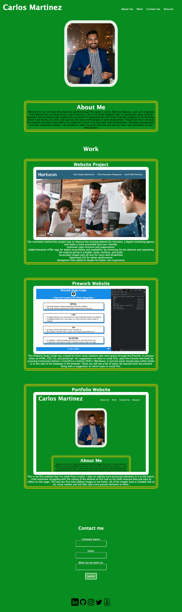

#  Portfolio Website

## Description

Provide a short description explaining the what, why, and how of your project. Use the following questions as a guide:

- What was your motivation?
- Why did you build this project? (Note: the answer is not "Because it was a homework assignment.")
- What problem does it solve?
- What did you learn?

The motivation behind this project is to showcase projects that I have worked on, I plan to update the project as I do more thought out the course. I wanted to showcase what I have already worked on and what I build upon my skills with CSS. I learned a lot on how to style a webpage with CSS and how to use html tags. 

## Installation

NA

## Usage

[Deployed website](https://carlosmb001.github.io/portfolio_website/)

## Credits

https://www.w3schools.com/html/default.asp  
https://css-tricks.com/snippets/css/a-guide-to-flexbox/  
https://coding-boot-camp.github.io/full-stack/  

